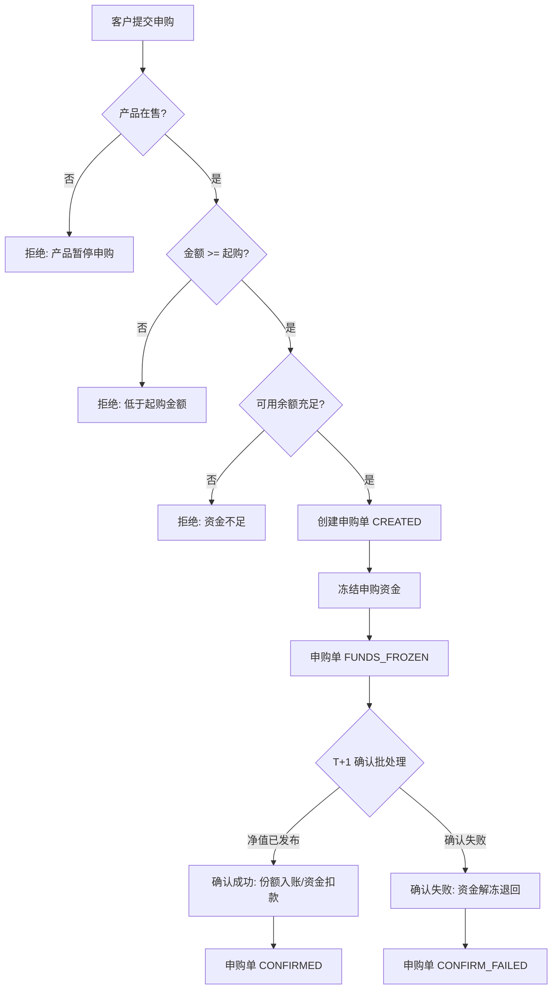
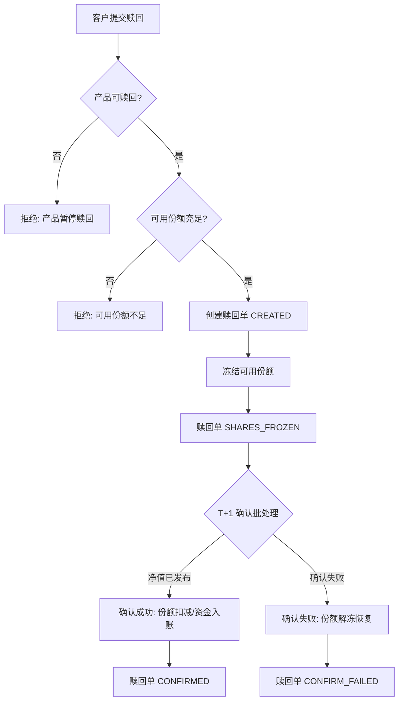
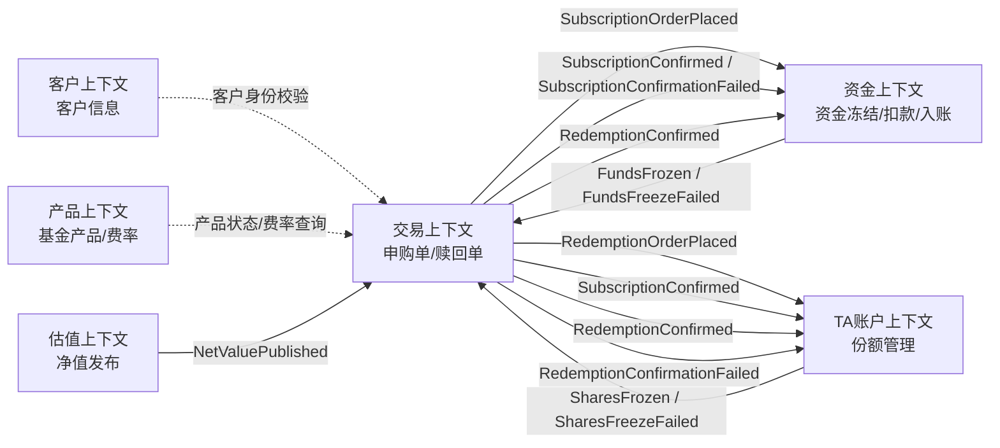

# 业务需求文档（BRD）

> 文档编号：BRD-001 ｜ 版本 v1.0 ｜ 状态：已评审 ｜ 日期：2026-08-30

## 一、背景与目标

为基金销售业务搭建一套**基金申购赎回管理系统**，支持客户完成基金申购、赎回、订单查询与持仓查询的完整闭环，并严格遵循证券基金交易的业务规则（交易日历、交易截止时间、T+1 份额确认、资金冻结、TA 账户份额管理）。

**业务目标：**
1. 申购/赎回全流程自动化、规则合规
2. 资金与份额的冻结/解冻/扣减全链路可追溯
3. 跨上下文协作解耦（交易/资金/TA 账户/估值/产品/客户）

## 二、业务范围与核心规则

**核心功能：**
1. 用户基金申购（下单 → 资金冻结 → T+1 份额确认）
2. 基金赎回（下单 → 份额冻结 → T+1 赎回款确认入账）
3. 申购 / 赎回订单查询（分页、筛选、状态轨迹）
4. 基金持仓查询（总份额 / 可用份额 / 冻结份额 / 市值）

**核心业务规则：**

| 规则 | 说明 |
| --- | --- |
| 交易日历 | 周末及法定节假日非交易日；非交易日（或非交易时段）提交的申请，T 日顺延至下一交易日 |
| 交易截止时间 | 交易日 15:00 截单：15:00 前（含）提交 → 当日为 T 日；15:00 后提交 → 下一交易日为 T 日 |
| T+1 份额确认 | T 日下单，T 日净值发布后，于 T+1 日确认：申购按确认净值计算份额；赎回按确认净值计算金额 |
| 资金冻结 | 申购下单即冻结申购资金；确认成功后扣款，确认失败自动解冻退回 |
| TA 账户份额管理 | 每客户每基金维护 TA 份额账户（总份额 = 可用份额 + 冻结份额）；赎回下单冻结可用份额，确认后扣减，失败解冻 |

**默认规则约定：** 申购费**外扣法**（净申购金额 = 申购金额 ÷ (1 + 申购费率)）；赎回费按持有天数梯度（<7天 1.5%、7~365天 0.5%、366~730天 0.25%、>730天 0%）；金额保留 2 位小数、份额保留 2 位小数、净值保留 4 位小数。

## 三、限界上下文划分（业务视角）

| 限界上下文 | 核心职责 | 关键对象 |
| --- | --- | --- |
| 客户（Customer） | 客户信息、风险等级、身份校验 | Customer |
| TA 账户（TAAccount） | 份额登记、份额冻结/解冻/扣减/入账 | TaAccount、SharePosition |
| 产品（Product） | 基金产品定义、费率规则、在售状态 | FundProduct |
| 交易（Trading） | 申购单/赎回单全生命周期管理与状态机 | SubscriptionOrder、RedemptionOrder |
| 估值（Valuation） | 基金净值录入、发布与查询 | NetValue |
| 资金（Funds） | 资金账户、冻结/解冻/扣款/入账 | FundsAccount |

> 跨上下文协作一律通过**领域事件**，禁止上下文之间直接调用对方领域模型。

## 四、用户故事地图（史诗 → 能力 → 用户故事）

### 史诗 1：基金申购

| 能力 | 编号 | 用户故事 |
| --- | --- | --- |
| 申购下单 | US1.1 | 作为客户，我想浏览在售基金列表并查看产品详情（费率、风险等级），以便选择申购标的 |
| 申购下单 | US1.2 | 作为客户，我想输入申购金额提交申购，系统自动按交易日历与 15:00 截单规则确定 T 日 |
| 申购下单 | US1.3 | 作为客户，我希望下单时系统自动冻结对应资金，余额不足时明确提示失败且资金无变动 |
| 申购确认 | US1.4 | 作为客户，我想在 T+1 日看到申购确认结果：确认份额、确认净值、申购费用 |
| 申购确认 | US1.5 | 作为客户，我希望申购确认失败时（如净值未发布、产品异常），资金自动解冻退回并告知失败原因 |

### 史诗 2：基金赎回

| 能力 | 编号 | 用户故事 |
| --- | --- | --- |
| 赎回下单 | US2.1 | 作为客户，我想基于持仓输入赎回份额提交赎回，系统校验并冻结可用份额 |
| 赎回下单 | US2.2 | 作为客户，可用份额不足时我希望得到明确的失败提示且持仓无变动 |
| 赎回确认 | US2.3 | 作为客户，我想在 T+1 日看到赎回确认结果：确认净值、赎回费用、到账金额，赎回款自动入账 |
| 赎回确认 | US2.4 | 作为客户，赎回确认失败时我希望份额自动解冻、恢复可用 |

### 史诗 3：订单查询

| 能力 | 编号 | 用户故事 |
| --- | --- | --- |
| 订单列表 | US3.1 | 作为客户，我想分页查询我的申购/赎回订单，支持按订单状态、日期区间、产品筛选 |
| 订单详情 | US3.2 | 作为客户，我想查看订单详情及状态流转轨迹（下单→冻结→确认） |

### 史诗 4：持仓查询

| 能力 | 编号 | 用户故事 |
| --- | --- | --- |
| 持仓列表 | US4.1 | 作为客户，我想查看各基金持仓：总份额、可用份额、冻结份额、最新净值、参考市值 |
| 持仓明细 | US4.2 | 作为客户，我想查看单只基金的持仓明细与历史交易记录 |

### 史诗 5：基础支撑（管理端）

| 能力 | 编号 | 用户故事 |
| --- | --- | --- |
| 产品管理 | US5.1 | 作为运营人员，我想维护基金产品（创建、上架、暂停申购/赎回） |
| 净值管理 | US5.2 | 作为运营人员，我想录入并发布 T 日基金净值，触发后续 T+1 确认处理 |
| 交易日历维护 | US5.3 | 作为运营人员，我想维护交易日历（标注节假日、非交易日） |
| 账户开立 | US5.4 | 作为运营人员，我想为客户开立 TA 账户与资金账户（含初始入金） |

## 五、核心业务场景（GIVEN / WHEN / THEN）

> 以下场景同时作为 TDD 测试用例素材与验收标准。

### A. 交易日历与截单时间

**S-01 当日为交易日且 15:00 前提交申购，T 日为当日**
- GIVEN 当日为交易日（周二），当前时间为 14:30
- WHEN 客户提交一笔 5000 元的申购申请
- THEN 系统以当日为 T 日，订单申请日期（T 日）为当日

**S-02 当日为交易日且 15:00 后提交申购，T 日为下一交易日**
- GIVEN 当日为交易日（周二），当前时间为 15:30
- WHEN 客户提交一笔申购申请
- THEN 系统以下一交易日（周三）为 T 日

**S-03 周末提交申购，T 日顺延至周一**
- GIVEN 当日为周六
- WHEN 客户提交一笔申购申请
- THEN 系统以下一交易日（周一）为 T 日

**S-04 法定节假日提交申购，T 日顺延至节后首个交易日**
- GIVEN 当日为 2026-10-01（法定节假日），且 10-02 至 10-07 均为节假日
- WHEN 客户提交一笔申购申请
- THEN 系统以节后首个交易日（如 10-08，若其为工作日）为 T 日

### B. 申购下单

**S-05 暂停申购的产品拒绝下单**
- GIVEN 基金产品 X 状态为「暂停申购」
- WHEN 客户对产品 X 提交申购申请
- THEN 下单失败并返回明确错误提示，不生成订单，资金账户无任何变动

**S-06 申购下单成功并冻结资金**
- GIVEN 客户资金账户可用余额 10000 元，产品 X 在售、起购金额 100 元
- WHEN 客户对产品 X 提交 5000 元申购
- THEN 下单成功；资金账户冻结 5000 元（可用余额变为 5000 元）；申购单状态为「待确认」；T 日按 S-01~S-04 规则确定

**S-07 资金不足下单失败**
- GIVEN 客户资金账户可用余额 3000 元
- WHEN 客户提交 5000 元申购
- THEN 下单失败：提示资金不足；资金账户余额与冻结金额均不变动

**S-08 低于起购金额下单失败**
- GIVEN 产品 X 起购金额为 1000 元
- WHEN 客户提交 500 元申购
- THEN 下单失败：提示低于起购金额，资金无变动

### C. 申购 T+1 确认

**S-09 申购确认成功（计算份额）**
- GIVEN T 日存在一笔 10000 元的待确认申购单，产品申购费率 1.0%（外扣法），T 日净值为 1.2500
- WHEN T+1 日确认批处理执行（净值已发布）
- THEN 确认成功：净申购金额 = 10000 ÷ 1.01 = 9900.99 元，申购费 = 99.01 元，确认份额 = 9900.99 ÷ 1.2500 = 7920.79 份；申购单状态转「已确认」；资金账户扣除冻结的 10000 元；TA 账户该基金份额增加 7920.79

**S-10 T 日净值未发布，订单顺延处理**
- GIVEN T 日存在待确认申购单，但 T 日净值尚未发布
- WHEN T+1 日确认批处理执行
- THEN 该订单保持「待确认」状态，不报错；待净值发布后的下一次批处理再确认

**S-11 申购确认失败自动解冻退款**
- GIVEN T 日存在待确认申购单（已冻结资金 5000 元），且确认环节判定失败（如净值异常）
- WHEN 确认批处理执行
- THEN 申购单状态转「确认失败」并记录失败原因；资金账户解冻 5000 元退回可用余额；TA 账户份额不变

**S-12 确认成功后持仓可见**
- GIVEN S-09 的申购确认已成功执行
- WHEN 客户查询产品 X 持仓
- THEN 持仓总份额与可用份额均增加 7920.79 份，冻结份额不变

### D. 赎回下单与确认

**S-13 赎回下单成功并冻结份额**
- GIVEN 客户 TA 账户持有产品 X 总份额 10000 份，冻结 0 份（可用 10000 份）
- WHEN 客户提交赎回 8000 份
- THEN 下单成功；持仓冻结份额变为 8000、可用份额变为 2000；赎回单状态「待确认」；T 日按交易日历与截单规则确定

**S-14 可用份额不足赎回失败**
- GIVEN 客户持有产品 X 可用份额 2000 份（另有 8000 份因在途赎回被冻结）
- WHEN 客户提交赎回 5000 份
- THEN 下单失败：提示可用份额不足；持仓份额无任何变动

**S-15 赎回 T+1 确认成功（计算金额并入账）**
- GIVEN T 日存在一笔赎回 5000 份的待确认赎回单，持有天数超过 730 天（赎回费率 0%），T 日净值 1.3000
- WHEN T+1 日确认批处理执行
- THEN 确认成功：赎回金额 = 5000 × 1.3000 − 0 = 6500.00 元；赎回单状态转「已确认」；TA 账户总份额扣减 5000、冻结份额扣减 5000；资金账户可用余额入账 6500.00 元

**S-16 赎回确认失败解冻份额**
- GIVEN T 日存在待确认赎回单（已冻结 8000 份），确认环节判定失败
- WHEN 确认批处理执行
- THEN 赎回单状态转「确认失败」并记录原因；TA 账户解冻 8000 份恢复可用；资金账户无变动

### E. 查询

**S-17 订单分页条件查询**
- GIVEN 客户名下存在多笔不同状态（待确认/已确认/确认失败）、不同日期的申购与赎回订单
- WHEN 客户按「状态 = 待确认 且 日期区间 = 本月」查询申购订单
- THEN 返回符合条件的分页列表（含订单号、产品、金额/份额、状态、T 日），总数正确

**S-18 持仓查询展示份额与市值**
- GIVEN 客户持有 3 只基金，其中 1 只有在途赎回冻结份额，各基金最新净值已发布
- WHEN 客户查询持仓列表
- THEN 每只基金展示：总份额、可用份额、冻结份额、最新净值、参考市值（总份额 × 最新净值）

### F. 管理支撑

**S-19 净值发布触发确认事件**
- GIVEN 管理员已录入产品 X 的 T 日净值但尚未发布
- WHEN 管理员点击发布
- THEN 系统发布 NetValuePublished 领域事件，T 日产品 X 的待确认订单具备确认条件

**S-20 交易日历维护生效**
- GIVEN 管理员将 2026-10-01 至 2026-10-07 标注为节假日
- WHEN 客户在 2026-09-30（工作日）15:30 提交申购
- THEN T 日为 2026-10-08（顺延过整个假期）

## 六、Mermaid 业务流程图

### 申购全流程

### 赎回全流程

### 上下文协作（领域事件驱动）

## 七、非功能需求

| 类别 | 需求 |
| --- | --- |
| 可靠性 | 金额/份额/净值全链路 BigDecimal 精确计算，杜绝浮点误差 |
| 可测试性 | 20 个 GIVEN/WHEN/THEN 场景全覆盖自动化测试 |
| 可维护性 | DDD 四层分层，业务规则收敛于领域层 |
| 部署 | 免费云部署，任意设备可访问，数据自动持久化 |
| 安全 | 金额精度校验、业务规则强校验；演示系统不涉真实资金 |

## 八、待确认问题清单

| # | 问题 | 当前默认方案（按默认方案先行） |
| --- | --- | --- |
| 1 | 申购费采用外扣法还是内扣法？ | 外扣法：净申购金额 = 申购金额 ÷ (1 + 费率) |
| 2 | 赎回费率梯度具体规则？ | <7天 1.5%；7~365天 0.5%；366~730天 0.25%；>730天 0 |
| 3 | 份额精度与舍入规则？ | 份额 2 位小数四舍五入；金额 2 位；净值 4 位 |
| 4 | 15:00 后、确认前的订单是否允许撤单？ | 本期不支持撤单，后续版本迭代 |
| 5 | 巨额赎回（单日赎回超基金总份额 10%）是否延期处理？ | 本期不实现，仅记录并提示 |
| 6 | 资金账户为系统内记账还是对接外部支付渠道？ | 系统内记账（简化模型），预留资金上下文接口 |
| 7 | T+1 确认批处理触发方式？ | 定时任务（每日）+ 管理端手动触发双通道 |
| 8 | 客户风险等级与产品风险等级匹配校验是否本期实现？ | 建议放 P1（本期客户上下文仅做身份校验） |
