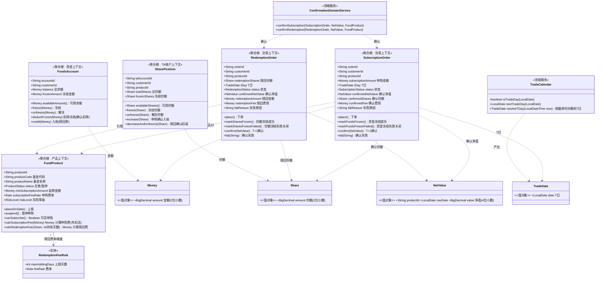
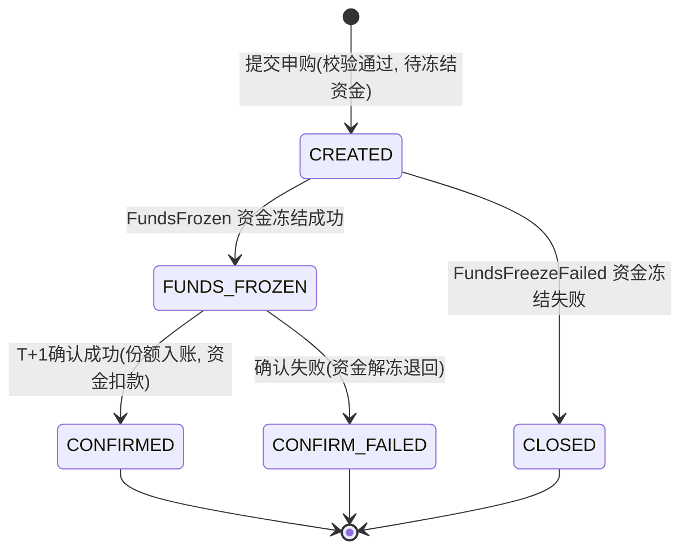
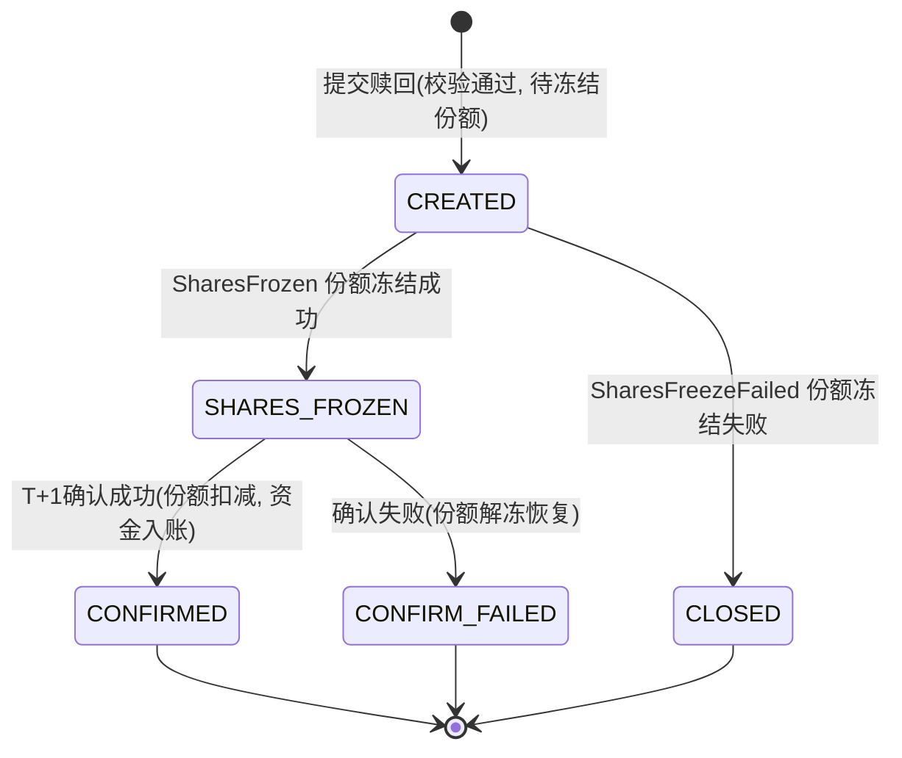

# 技术设计文档（System Design）

> 文档编号：DESIGN-001 ｜ 版本 v1.0 ｜ 状态：已实现 ｜ 日期：2026-08-30

## 一、系统架构

前后端分离架构，RESTful JSON API 通信：

```
┌──────────────────┐      HTTP/JSON       ┌──────────────────┐
│  前端（Vue3 +    │ ──────────────────▶  │  后端（Java 21 +  │
│  Element Plus）  │ ◀──────────────────  │  Spring Boot 3.x）│
└──────────────────┘      CORS 已配置      └────────┬─────────┘
                                                     │ jdbc
                                             ┌───────▼────────┐
                                             │  PostgreSQL 16  │
                                             └────────────────┘
```

- 前端：Vue3 + Vite + Element Plus + axios（`frontend/`）
- 后端：JDK21 + Spring Boot 3.2，DDD 四层（`backend/`）
- 数据库：PostgreSQL 16（生产/云端 Neon；本地 Homebrew PG）
- 测试：JUnit 5，领域单测（纯内存）+ 集成测试（PG 测试库）+ API 冒烟（MockMvc）

## 二、DDD 领域模型

### 2.1 聚合设计与不变量

| 聚合根 | 所属上下文 | 聚合边界内对象 | 核心不变量（业务规则收敛于此） |
| --- | --- | --- | --- |
| FundProduct | 产品 | 赎回费率规则（实体）、费率值对象 | 在售状态才可申购/赎回；费率规则合法（0 ≤ 费率 < 1）；起购金额 > 0 |
| SubscriptionOrder | 交易 | 状态机、确认结果值对象 | 状态只能沿状态机单向流转；确认必须在资金冻结成功后；确认份额/费用仅在确认时一次性写入 |
| RedemptionOrder | 交易 | 状态机、确认结果值对象 | 状态只能沿状态机单向流转；确认必须在份额冻结成功后；赎回份额 > 0 且不超过下单时冻结份额 |
| SharePosition | TA 账户 | 份额值对象 | 总份额 = 可用份额 + 冻结份额；冻结/解冻不可超过可用/冻结份额；各份额非负 |
| FundsAccount | 资金 | Money 值对象 | 可用余额 = 余额 − 冻结金额；冻结不可超过可用余额；金额非负、精度 2 位 |

### 2.2 领域模型图



> 聚合之间**只通过 ID 引用**（如订单持有 productId），禁止对象级关联导航；跨聚合一致性由领域事件 + 应用事务保证。

### 2.3 订单状态机

**申购单状态机：**



**赎回单状态机：**



## 三、领域事件清单

| # | 事件名（中文名） | 发布方上下文 | 订阅方上下文 | 触发时机 | 携带数据 | 订阅方后续动作 |
| --- | --- | --- | --- | --- | --- | --- |
| 1 | SubscriptionOrderPlaced（申购单已下单） | 交易 | 资金 | 申购单创建成功，状态 CREATED | orderId、customerId、productId、金额、T日 | 资金账户冻结对应金额（成功→事件2；失败→事件3） |
| 2 | FundsFrozen（资金已冻结） | 资金 | 交易 | 申购资金冻结成功 | orderId、冻结金额、冻结流水号 | 申购单状态 CREATED → FUNDS_FROZEN |
| 3 | FundsFreezeFailed（资金冻结失败） | 资金 | 交易 | 可用余额不足等冻结失败 | orderId、失败原因 | 申购单状态 CREATED → CLOSED |
| 4 | RedemptionOrderPlaced（赎回单已下单） | 交易 | TA 账户 | 赎回单创建成功，状态 CREATED | orderId、customerId、productId、赎回份额、T日 | 份额持仓冻结对应份额（成功→事件5；失败→事件6） |
| 5 | SharesFrozen（份额已冻结） | TA 账户 | 交易 | 可用份额冻结成功 | orderId、冻结份额 | 赎回单状态 CREATED → SHARES_FROZEN |
| 6 | SharesFreezeFailed（份额冻结失败） | TA 账户 | 交易 | 可用份额不足等冻结失败 | orderId、失败原因 | 赎回单状态 CREATED → CLOSED |
| 7 | NetValuePublished（净值已发布） | 估值 | 交易 | 管理员发布 T 日净值 | productId、净值日期、净值 | 使 T 日该产品待确认订单具备确认条件（供批处理消费） |
| 8 | SubscriptionConfirmed（申购已确认） | 交易 | TA 账户、资金 | T+1 批处理确认申购成功 | orderId、确认份额、确认净值、申购费 | TA 账户持仓 increase；资金账户 deductFrozen（扣除冻结申购款） |
| 9 | SubscriptionConfirmationFailed（申购确认失败） | 交易 | 资金 | 确认环节失败 | orderId、失败原因 | 资金账户 unfreeze（解冻退回） |
| 10 | RedemptionConfirmed（赎回已确认） | 交易 | TA 账户、资金 | T+1 批处理确认赎回成功 | orderId、确认净值、赎回费、赎回金额 | TA 账户 decreaseAndUnfreeze；资金账户 credit（赎回款入账） |
| 11 | RedemptionConfirmationFailed（赎回确认失败） | 交易 | TA 账户 | 确认环节失败 | orderId、失败原因 | 持仓 unfreeze（解冻恢复可用） |
| 12 | ProductSuspended（产品已暂停申购） | 产品 | 交易 | 运营暂停产品 | productId、生效时间 | 后续该产品下单请求直接拒绝（下单前置校验） |

> 事件实现：进程内事件总线（Spring ApplicationEvent 适配），同一事务内发布，事件处理器由应用层编排，各上下文只消费自己关心的事件。

## 四、DDD 四层分层规范

### 4.1 分层职责与禁止事项

| 层 | 组成 | 职责 | 严禁 |
| --- | --- | --- | --- |
| api | Controller、出入参 DTO、全局异常处理器、统一响应体 | 接收请求、Bean Validation 参数校验、调用应用服务、响应封装 | 出现任何业务规则；直接访问仓储或数据库 |
| application | ApplicationService、事件分发器、T+1 确认批处理 Job | 流程编排（取聚合→调领域方法→存仓储→发事件）、事务边界管理（`@Transactional`）、领域事件发布/订阅 | 编写核心业务规则；持有业务状态 |
| domain | 聚合根、实体、值对象、领域服务、领域事件、仓储接口 | **全部业务规则与不变量**：状态机流转、份额/金额计算、交易日历、费率计算 | 依赖 Spring 框架注解（除仓储接口外）；直接依赖数据库/HTTP 等基础设施 |
| infrastructure | 仓储实现、数据库映射、事件总线实现、时间与日历数据适配、数据源配置 | 技术细节实现；实现 domain 层定义的仓储接口；领域事件 → Spring 事件适配 | 反向依赖 application / api 层 |

**跨上下文协作铁律：** 客户/产品/估值/资金/TA 账户上下文之间禁止直接方法调用，一律通过领域事件异步解耦；同上下文内允许领域服务组合调用。

### 4.2 工程目录结构

```
fund-trade-system/
├── backend/                                    # Java JDK21 + Spring Boot 3.x
│   └── src/
│       ├── main/
│       │   ├── java/com/fund/trade/
│       │   │   ├── api/                        # ① api 层
│       │   │   │   ├── ProductController.java / OrderController.java
│       │   │   │   ├── CustomerController.java / AdminController.java
│       │   │   │   ├── ApiResponse.java（统一响应体）
│       │   │   │   └── GlobalExceptionHandler.java
│       │   │   ├── application/                # ② application 应用层
│       │   │   │   ├── SubscriptionAppService.java / RedemptionAppService.java
│       │   │   │   ├── ConfirmationAppService.java / QueryAppService.java
│       │   │   │   ├── event/（FundsContext / TaAccount / TradeContext 事件处理器）
│       │   │   │   └── ErrorCode.java / BusinessException.java
│       │   │   ├── domain/                     # ③ domain 领域层（纯 Java，无框架依赖）
│       │   │   │   ├── model/（product / order / position / funds 聚合）
│       │   │   │   ├── valueobject/（Money / Share / NetValue / TradeDate / Rate）
│       │   │   │   ├── service/（TradeCalendar / ConfirmationDomainService）
│       │   │   │   ├── event/（DomainEvent / DomainEvents / DomainEventPublisher）
│       │   │   │   └── repository/（8 个仓储接口）
│       │   │   └── infrastructure/             # ④ infrastructure 基础设施层
│       │   │       ├── persistence/（8 个 SQLite/PG 仓储实现 + DatabaseInitializer）
│       │   │       ├── config/（WebMvcConfig CORS）
│       │   │       └── SystemTradeTimeProvider.java
│       │   └── resources/（schema.sql / application.yml）
│       └── test/（domain 单测 / integration 集成测试 / api 冒烟 / testsupport）
└── frontend/                                   # Vue3 + Element Plus
    └── src/
        ├── views/（ProductsView / OrdersView / PositionsView / AdminView）
        ├── api/index.js（axios 封装，统一解包 code=0）
        └── App.vue（四 Tab 导航）
```

### 4.3 代码架构铁律：防循环依赖

- 函数调用关系必须构成**有向无环图（DAG）**，严禁渲染函数互调形成环路
- 分层：`数据层 → 计算层 → 渲染层`，只允许上层调下层或同层内单向调用
- 设置统一刷新入口 `refreshAll()`，用户交互 → 改数据 → `refreshAll()` 按序渲染
- 防御性初始化：`DOMContentLoaded` 中按固定顺序 加载数据 → 初始化状态 → `refreshAll()`

## 五、TDD 开发策略

### 5.1 红 → 绿 → 重构循环

1. **红**：从 BRD 第四章 GIVEN/WHEN/THEN 场景中选取一个，先编写失败的测试用例；
2. **绿**：编写**最小**实现代码让测试通过（允许丑陋，不允许缺功能）；
3. **重构**：消除重复、改善命名、下沉规则到领域层，测试保持绿色。

### 5.2 测试分层策略

| 测试类型 | 范围 | 依赖 | 用例来源 |
| --- | --- | --- | --- |
| 领域单元测试（优先、占比最大） | 聚合行为、值对象、领域服务（交易日历解析、费用/份额计算、状态机、不变量） | 纯 Java 内存对象，不依赖 Spring 与数据库 | S-01 ~ S-16 中可脱离数据库的规则断言 |
| 应用层集成测试 | 下单→冻结→确认端到端流程、事件分发、事务 | `@SpringBootTest` + PostgreSQL 测试库 | S-06/S-09/S-13/S-15 等完整流程 |
| API 测试 | Controller 参数校验、响应封装、错误码 | MockMvc | PRD 第三章接口契约 |

### 5.3 场景 → 测试用例映射示例

```java
/**
 * 场景 S-02：交易日 15:00 后提交申购，T 日为下一交易日
 * GIVEN 当日为交易日(周二) 且时间为 15:30
 * WHEN  解析 T 日
 * THEN  T 日为周三(下一交易日)
 */
@Test
void GIVEN_交易日15点30分_WHEN_解析T日_THEN_T日为下一交易日() {
    LocalDate tuesday = LocalDate.of(2026, 9, 1);   // 周二，交易日
    LocalDateTime afterCutoff = tuesday.atTime(15, 30);
    TradeCalendar calendar = TradeCalendar.of(Set.of()); // 无额外节假日

    TradeDate tDay = calendar.resolveTDay(afterCutoff);

    assertEquals(LocalDate.of(2026, 9, 2), tDay.date());
}
```

### 5.4 测试现状

- **74 个自动化测试全绿**：62 个领域单测 + 12 个集成/API 测试
- CI（GitHub Actions）：JDK21 + PostgreSQL 16 service + `mvn test` + 前端构建，push 自动执行

## 六、里程碑

| 里程碑 | 内容 | 状态 |
| --- | --- | --- |
| M1 领域内核 | 值对象 + TradeCalendar + 四个聚合 + 领域单元测试全绿 | ✅ 完成 |
| M2 流程闭环 | 领域事件 + 应用层 + PostgreSQL 仓储 + 集成测试 | ✅ 完成 |
| M3 接口与前端 | REST API + Vue3 页面（下单/订单/持仓/管理端） | ✅ 完成 |
| M4 部署上线 | 云端部署（Cloudflare + Render + Neon）+ 端到端验收 | ✅ 完成 |
