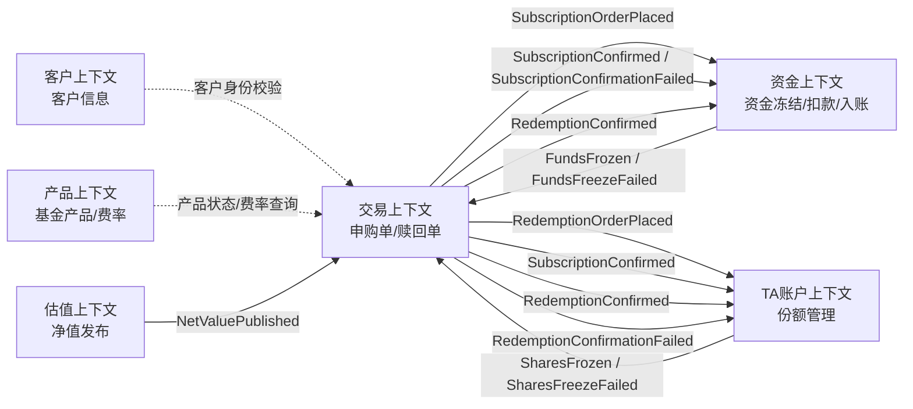
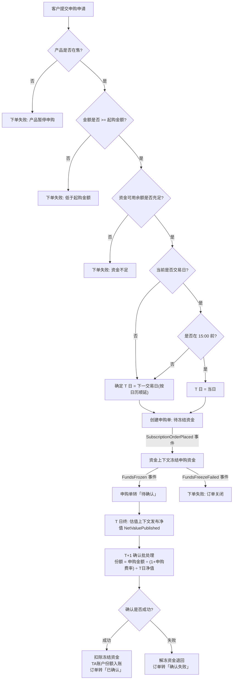
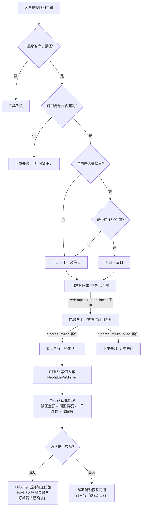
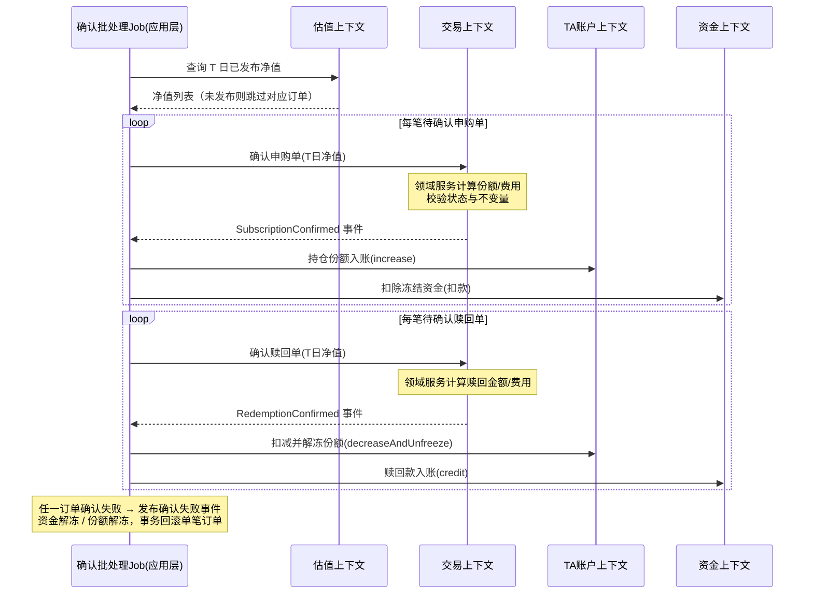
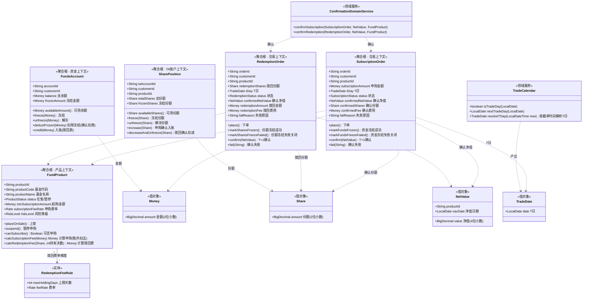
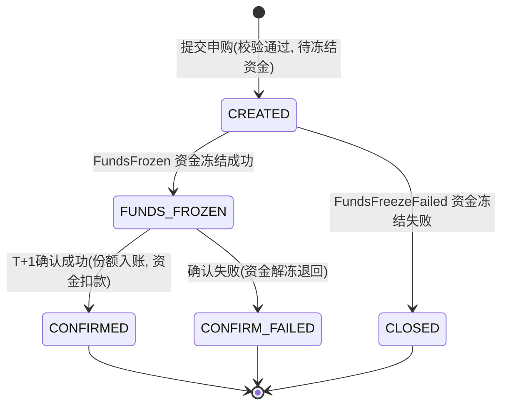
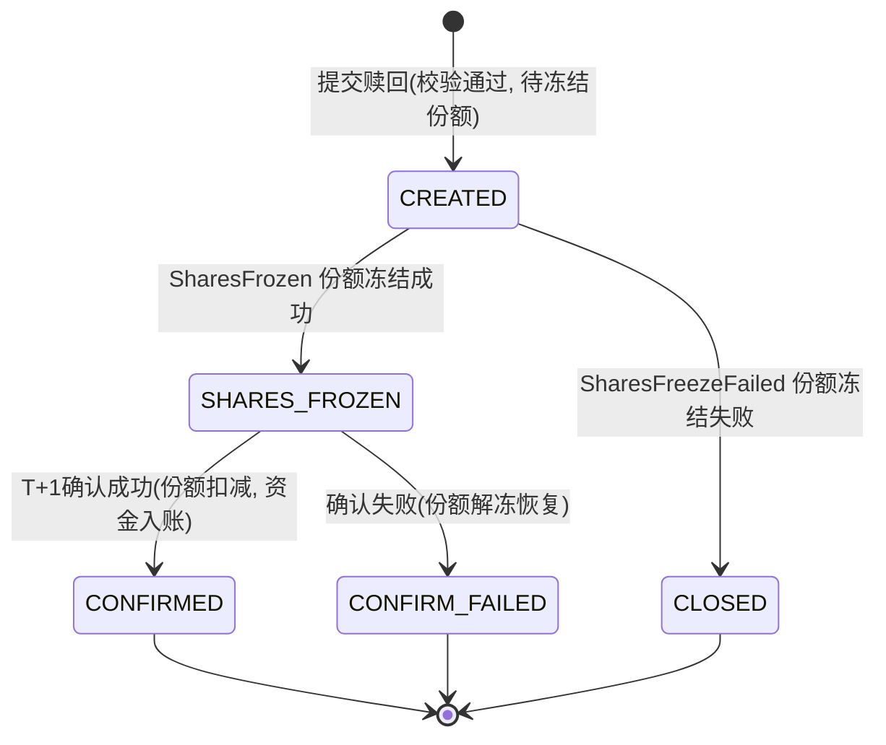

# 基金申购赎回管理系统 · 需求设计文档

| 项目 | 内容 |
| --- | --- |
| 文档版本 | v1.0 |
| 编写日期 | 2026-08-30 |
| 文档类型 | 需求设计文档（PRD + DDD 领域设计） |
| 状态 | 待评审 |

> 本文档覆盖：用户故事地图、GIVEN/WHEN/THEN 业务场景、Mermaid 业务流程图、DDD 领域模型图、领域事件清单、REST API 接口清单、DDD 分层规范与 TDD 开发策略。

---

## 一、项目概述

### 1.1 背景与目标

为基金销售业务搭建一套**基金申购赎回管理系统**，支持客户完成基金申购、赎回、订单查询与持仓查询的完整闭环，并严格遵循证券基金交易的业务规则（交易日历、交易截止时间、T+1 份额确认、资金冻结、TA 账户份额管理）。

### 1.2 业务范围

**核心功能：**
1. 用户基金申购（下单 → 资金冻结 → T+1 份额确认）
2. 基金赎回（下单 → 份额冻结 → T+1 赎回款确认入账）
3. 申购 / 赎回订单查询（分页、筛选、状态轨迹）
4. 基金持仓查询（总份额 / 可用份额 / 冻结份额 / 市值）

**核心业务规则：**

| 规则 | 说明 |
| --- | --- |
| 交易日历 | 周末及法定节假日非交易日；非交易日（或非交易时段）提交的申请，T 日顺延至下一交易日 |
| 交易截止时间 | 交易日 15:00 截单：15:00 前（含）提交 → 当日为 T 日；15:00 后提交 → 下一交易日为 T 日 |
| T+1 份额确认 | T 日下单，T 日净值发布后，于 T+1 日确认：申购按确认净值计算份额；赎回按确认净值计算金额 |
| 资金冻结 | 申购下单即冻结申购资金；确认成功后扣款，确认失败自动解冻退回 |
| TA 账户份额管理 | 每客户每基金维护 TA 份额账户（总份额 = 可用份额 + 冻结份额）；赎回下单冻结可用份额，确认后扣减，失败解冻 |

### 1.3 技术架构约束

| 项 | 选型 |
| --- | --- |
| 架构 | 前后端分离，RESTful JSON API 通信 |
| 前端 | Vue3 + Element Plus |
| 后端 | Java JDK21 + Spring Boot 3.x，标准 DDD 四层分层 |
| 数据库 | SQLite（集成测试使用 SQLite 内存库 `jdbc:sqlite::memory:`） |
| 开发模式 | TDD 测试驱动开发（红→绿→重构） |

---

## 二、限界上下文划分

| 限界上下文 | 核心职责 | 关键对象 | 对外发布事件 | 消费事件 |
| --- | --- | --- | --- | --- |
| 客户（Customer） | 客户信息、风险等级、身份校验 | Customer | — | — |
| TA 账户（TAAccount） | 份额登记、份额冻结/解冻/扣减/入账 | TaAccount、**SharePosition（聚合）** | SharesFrozen、SharesFreezeFailed | RedemptionOrderPlaced、SubscriptionConfirmed、RedemptionConfirmed、RedemptionConfirmationFailed |
| 产品（Product） | 基金产品定义、费率规则、在售状态 | **FundProduct（聚合）** | ProductSuspended | — |
| 交易（Trading） | 申购单/赎回单全生命周期管理与状态机 | **SubscriptionOrder（聚合）、RedemptionOrder（聚合）** | SubscriptionOrderPlaced、RedemptionOrderPlaced、SubscriptionConfirmed、SubscriptionConfirmationFailed、RedemptionConfirmed、RedemptionConfirmationFailed | FundsFrozen、FundsFreezeFailed、SharesFrozen、SharesFreezeFailed、NetValuePublished |
| 估值（Valuation） | 基金净值录入、发布与查询 | NetValue（值对象）、净值发布记录 | NetValuePublished | — |
| 资金（Funds） | 资金账户、冻结/解冻/扣款/入账 | FundsAccount（聚合） | FundsFrozen、FundsFreezeFailed | SubscriptionOrderPlaced、SubscriptionConfirmed、SubscriptionConfirmationFailed、RedemptionConfirmed |

**上下文协作关系图：**



> 跨上下文协作一律通过**领域事件**（进程内事件总线实现），禁止上下文之间直接调用对方领域模型。

---

## 三、用户故事地图（史诗 → 能力 → 用户故事）

### 史诗 1：基金申购

| 能力 | 编号 | 用户故事 |
| --- | --- | --- |
| 申购下单 | US1.1 | 作为客户，我想浏览在售基金列表并查看产品详情（费率、风险等级），以便选择申购标的 |
| 申购下单 | US1.2 | 作为客户，我想输入申购金额提交申购，系统自动按交易日历与 15:00 截单规则确定 T 日 |
| 申购下单 | US1.3 | 作为客户，我希望下单时系统自动冻结对应资金，余额不足时明确提示失败且资金无变动 |
| 申购确认 | US1.4 | 作为客户，我想在 T+1 日看到申购确认结果：确认份额、确认净值、申购费用 |
| 申购确认 | US1.5 | 作为客户，我希望申购确认失败时（如净值未发布、产品异常），资金自动解冻退回并告知失败原因 |

### 史诗 2：基金赎回

| 能力 | 编号 | 用户故事 |
| --- | --- | --- |
| 赎回下单 | US2.1 | 作为客户，我想基于持仓输入赎回份额提交赎回，系统校验并冻结可用份额 |
| 赎回下单 | US2.2 | 作为客户，可用份额不足时我希望得到明确的失败提示且持仓无变动 |
| 赎回确认 | US2.3 | 作为客户，我想在 T+1 日看到赎回确认结果：确认净值、赎回费用、到账金额，赎回款自动入账 |
| 赎回确认 | US2.4 | 作为客户，赎回确认失败时我希望份额自动解冻、恢复可用 |

### 史诗 3：订单查询

| 能力 | 编号 | 用户故事 |
| --- | --- | --- |
| 订单列表 | US3.1 | 作为客户，我想分页查询我的申购/赎回订单，支持按订单状态、日期区间、产品筛选 |
| 订单详情 | US3.2 | 作为客户，我想查看订单详情及状态流转轨迹（下单→冻结→确认） |

### 史诗 4：持仓查询

| 能力 | 编号 | 用户故事 |
| --- | --- | --- |
| 持仓列表 | US4.1 | 作为客户，我想查看各基金持仓：总份额、可用份额、冻结份额、最新净值、参考市值 |
| 持仓明细 | US4.2 | 作为客户，我想查看单只基金的持仓明细与历史交易记录 |

### 史诗 5：基础支撑（管理端）

| 能力 | 编号 | 用户故事 |
| --- | --- | --- |
| 产品管理 | US5.1 | 作为运营人员，我想维护基金产品（创建、上架、暂停申购/赎回） |
| 净值管理 | US5.2 | 作为运营人员，我想录入并发布 T 日基金净值，触发后续 T+1 确认处理 |
| 交易日历维护 | US5.3 | 作为运营人员，我想维护交易日历（标注节假日、非交易日） |
| 账户开立 | US5.4 | 作为运营人员，我想为客户开立 TA 账户与资金账户（含初始入金） |

---

## 四、核心业务场景（GIVEN / WHEN / THEN）

> 以下场景同时作为 TDD 测试用例素材与验收标准。默认规则：申购费**外扣法**（净申购金额 = 申购金额 ÷ (1 + 申购费率)）；赎回费按持有天数梯度（<7天 1.5%、7~365天 0.5%、366~730天 0.25%、>730天 0%）；金额保留 2 位小数、份额保留 2 位小数、净值保留 4 位小数。

### A. 交易日历与截单时间

**S-01 当日为交易日且 15:00 前提交申购，T 日为当日**
- GIVEN 当日为交易日（周二），当前时间为 14:30
- WHEN 客户提交一笔 5000 元的申购申请
- THEN 系统以当日为 T 日，订单申请日期（T 日）为当日

**S-02 当日为交易日且 15:00 后提交申购，T 日为下一交易日**
- GIVEN 当日为交易日（周二），当前时间为 15:30
- WHEN 客户提交一笔申购申请
- THEN 系统以下一交易日（周三）为 T 日

**S-03 周末提交申购，T 日顺延至周一**
- GIVEN 当日为周六
- WHEN 客户提交一笔申购申请
- THEN 系统以下一交易日（周一）为 T 日

**S-04 法定节假日提交申购，T 日顺延至节后首个交易日**
- GIVEN 当日为 2026-10-01（法定节假日），且 10-02 至 10-07 均为节假日
- WHEN 客户提交一笔申购申请
- THEN 系统以节后首个交易日（如 10-08，若其为工作日）为 T 日

### B. 申购下单

**S-05 暂停申购的产品拒绝下单**
- GIVEN 基金产品 X 状态为「暂停申购」
- WHEN 客户对产品 X 提交申购申请
- THEN 下单失败并返回明确错误提示，不生成订单，资金账户无任何变动

**S-06 申购下单成功并冻结资金**
- GIVEN 客户资金账户可用余额 10000 元，产品 X 在售、起购金额 100 元
- WHEN 客户对产品 X 提交 5000 元申购
- THEN 下单成功；资金账户冻结 5000 元（可用余额变为 5000 元）；申购单状态为「待确认」；T 日按 S-01~S-04 规则确定

**S-07 资金不足下单失败**
- GIVEN 客户资金账户可用余额 3000 元
- WHEN 客户提交 5000 元申购
- THEN 下单失败：提示资金不足；资金账户余额与冻结金额均不变动

**S-08 低于起购金额下单失败**
- GIVEN 产品 X 起购金额为 1000 元
- WHEN 客户提交 500 元申购
- THEN 下单失败：提示低于起购金额，资金无变动

### C. 申购 T+1 确认

**S-09 申购确认成功（计算份额）**
- GIVEN T 日存在一笔 10000 元的待确认申购单，产品申购费率 1.0%（外扣法），T 日净值为 1.2500
- WHEN T+1 日确认批处理执行（净值已发布）
- THEN 确认成功：净申购金额 = 10000 ÷ 1.01 = 9900.99 元，申购费 = 99.01 元，确认份额 = 9900.99 ÷ 1.2500 = 7920.79 份；申购单状态转「已确认」；资金账户扣除冻结的 10000 元；TA 账户该基金份额增加 7920.79

**S-10 T 日净值未发布，订单顺延处理**
- GIVEN T 日存在待确认申购单，但 T 日净值尚未发布
- WHEN T+1 日确认批处理执行
- THEN 该订单保持「待确认」状态，不报错；待净值发布后的下一次批处理再确认

**S-11 申购确认失败自动解冻退款**
- GIVEN T 日存在待确认申购单（已冻结资金 5000 元），且确认环节判定失败（如净值异常）
- WHEN 确认批处理执行
- THEN 申购单状态转「确认失败」并记录失败原因；资金账户解冻 5000 元退回可用余额；TA 账户份额不变

**S-12 确认成功后持仓可见**
- GIVEN S-09 的申购确认已成功执行
- WHEN 客户查询产品 X 持仓
- THEN 持仓总份额与可用份额均增加 7920.79 份，冻结份额不变

### D. 赎回下单与确认

**S-13 赎回下单成功并冻结份额**
- GIVEN 客户 TA 账户持有产品 X 总份额 10000 份，冻结 0 份（可用 10000 份）
- WHEN 客户提交赎回 8000 份
- THEN 下单成功；持仓冻结份额变为 8000、可用份额变为 2000；赎回单状态「待确认」；T 日按交易日历与截单规则确定

**S-14 可用份额不足赎回失败**
- GIVEN 客户持有产品 X 可用份额 2000 份（另有 8000 份因在途赎回被冻结）
- WHEN 客户提交赎回 5000 份
- THEN 下单失败：提示可用份额不足；持仓份额无任何变动

**S-15 赎回 T+1 确认成功（计算金额并入账）**
- GIVEN T 日存在一笔赎回 5000 份的待确认赎回单，持有天数超过 730 天（赎回费率 0%），T 日净值 1.3000
- WHEN T+1 日确认批处理执行
- THEN 确认成功：赎回金额 = 5000 × 1.3000 − 0 = 6500.00 元；赎回单状态转「已确认」；TA 账户总份额扣减 5000、冻结份额扣减 5000；资金账户可用余额入账 6500.00 元

**S-16 赎回确认失败解冻份额**
- GIVEN T 日存在待确认赎回单（已冻结 8000 份），确认环节判定失败
- WHEN 确认批处理执行
- THEN 赎回单状态转「确认失败」并记录原因；TA 账户解冻 8000 份恢复可用；资金账户无变动

### E. 查询

**S-17 订单分页条件查询**
- GIVEN 客户名下存在多笔不同状态（待确认/已确认/确认失败）、不同日期的申购与赎回订单
- WHEN 客户按「状态 = 待确认 且 日期区间 = 本月」查询申购订单
- THEN 返回符合条件的分页列表（含订单号、产品、金额/份额、状态、T 日），总数正确

**S-18 持仓查询展示份额与市值**
- GIVEN 客户持有 3 只基金，其中 1 只有在途赎回冻结份额，各基金最新净值已发布
- WHEN 客户查询持仓列表
- THEN 每只基金展示：总份额、可用份额、冻结份额、最新净值、参考市值（总份额 × 最新净值）

### F. 管理支撑

**S-19 净值发布触发确认事件**
- GIVEN 管理员已录入产品 X 的 T 日净值但尚未发布
- WHEN 管理员点击发布
- THEN 系统发布 NetValuePublished 领域事件，T 日产品 X 的待确认订单具备确认条件

**S-20 交易日历维护生效**
- GIVEN 管理员将 2026-10-01 至 2026-10-07 标注为节假日
- WHEN 客户在 2026-09-30（工作日）15:30 提交申购
- THEN T 日为 2026-10-08（顺延过整个假期）

---

## 五、Mermaid 业务流程图

### 5.1 申购全流程



### 5.2 赎回全流程



### 5.3 T+1 确认批处理时序



---

## 六、DDD 领域模型设计

### 6.1 聚合设计与不变量

| 聚合根 | 所属上下文 | 聚合边界内对象 | 核心不变量（业务规则收敛于此） |
| --- | --- | --- | --- |
| FundProduct | 产品 | 赎回费率规则（实体）、费率值对象 | 在售状态才可申购/赎回；费率规则合法（0 ≤ 费率 < 1）；起购金额 > 0 |
| SubscriptionOrder | 交易 | 状态机、确认结果值对象 | 状态只能沿状态机单向流转；确认必须在资金冻结成功后；确认份额/费用仅在确认时一次性写入 |
| RedemptionOrder | 交易 | 状态机、确认结果值对象 | 状态只能沿状态机单向流转；确认必须在份额冻结成功后；赎回份额 > 0 且不超过下单时冻结份额 |
| SharePosition | TA 账户 | 份额值对象 | 总份额 = 可用份额 + 冻结份额；冻结/解冻不可超过可用/冻结份额；各份额非负 |
| FundsAccount | 资金 | Money 值对象 | 可用余额 = 余额 − 冻结金额；冻结不可超过可用余额；金额非负、精度 2 位 |

### 6.2 领域模型图



> 聚合之间**只通过 ID 引用**（如订单持有 productId），禁止对象级关联导航；跨聚合一致性由领域事件 + 应用事务保证。

### 6.3 订单状态机

**申购单状态机：**



**赎回单状态机：**



---

## 七、领域事件清单

| # | 事件名（中文名） | 发布方上下文 | 订阅方上下文 | 触发时机 | 携带数据 | 订阅方后续动作 |
| --- | --- | --- | --- | --- | --- | --- |
| 1 | SubscriptionOrderPlaced（申购单已下单） | 交易 | 资金 | 申购单创建成功，状态 CREATED | orderId、customerId、productId、金额、T日 | 资金账户冻结对应金额（成功→事件2；失败→事件3） |
| 2 | FundsFrozen（资金已冻结） | 资金 | 交易 | 申购资金冻结成功 | orderId、冻结金额、冻结流水号 | 申购单状态 CREATED → FUNDS_FROZEN |
| 3 | FundsFreezeFailed（资金冻结失败） | 资金 | 交易 | 可用余额不足等冻结失败 | orderId、失败原因 | 申购单状态 CREATED → CLOSED |
| 4 | RedemptionOrderPlaced（赎回单已下单） | 交易 | TA 账户 | 赎回单创建成功，状态 CREATED | orderId、customerId、productId、赎回份额、T日 | 份额持仓冻结对应份额（成功→事件5；失败→事件6） |
| 5 | SharesFrozen（份额已冻结） | TA 账户 | 交易 | 可用份额冻结成功 | orderId、冻结份额 | 赎回单状态 CREATED → SHARES_FROZEN |
| 6 | SharesFreezeFailed（份额冻结失败） | TA 账户 | 交易 | 可用份额不足等冻结失败 | orderId、失败原因 | 赎回单状态 CREATED → CLOSED |
| 7 | NetValuePublished（净值已发布） | 估值 | 交易 | 管理员发布 T 日净值 | productId、净值日期、净值 | 使 T 日该产品待确认订单具备确认条件（供批处理消费） |
| 8 | SubscriptionConfirmed（申购已确认） | 交易 | TA 账户、资金 | T+1 批处理确认申购成功 | orderId、确认份额、确认净值、申购费 | TA 账户持仓 increase；资金账户 deductFrozen（扣除冻结申购款） |
| 9 | SubscriptionConfirmationFailed（申购确认失败） | 交易 | 资金 | 确认环节失败 | orderId、失败原因 | 资金账户 unfreeze（解冻退回） |
| 10 | RedemptionConfirmed（赎回已确认） | 交易 | TA 账户、资金 | T+1 批处理确认赎回成功 | orderId、确认净值、赎回费、赎回金额 | TA 账户 decreaseAndUnfreeze；资金账户 credit（赎回款入账） |
| 11 | RedemptionConfirmationFailed（赎回确认失败） | 交易 | TA 账户 | 确认环节失败 | orderId、失败原因 | 持仓 unfreeze（解冻恢复可用） |
| 12 | ProductSuspended（产品已暂停申购） | 产品 | 交易 | 运营暂停产品 | productId、生效时间 | 后续该产品下单请求直接拒绝（下单前置校验） |

> 事件实现：进程内事件总线（Spring ApplicationEvent 适配），同一事务内发布，事件处理器由应用层编排，各上下文只消费自己关心的事件。

---

## 八、REST API 接口清单

> 统一前缀 `/api`，统一响应体 `{ code, message, data }`；日期格式 `yyyy-MM-dd`；金额单位元（2 位小数）；分页参数 `pageNum`（从 1 起）/ `pageSize`。

### 8.1 客户端接口

| 方法 | 路径 | 说明 | 关键请求参数 | 成功响应 data | 主要错误码 |
| --- | --- | --- | --- | --- | --- |
| GET | /api/products | 在售基金产品列表（分页） | productName（模糊）、pageNum、pageSize | 产品列表（代码/名称/净值/费率/风险等级/状态） | — |
| GET | /api/products/{productId} | 产品详情 | 路径参数 | 产品完整信息 + 最新净值 + 赎回费率梯度 | 40401 产品不存在 |
| POST | /api/orders/subscription | 提交申购 | customerId、productId、subscriptionAmount | orderId、tDay、status、冻结金额 | 40001 产品暂停申购；40002 低于起购金额；40003 资金不足 |
| POST | /api/orders/redemption | 提交赎回 | customerId、productId、redemptionShares | orderId、tDay、status、冻结份额 | 40004 可用份额不足；40005 产品暂停赎回 |
| GET | /api/orders/subscription | 分页查询申购单 | customerId（必填）、status、productId、dateFrom、dateTo、pageNum、pageSize | 申购单分页列表（订单号/产品/金额/状态/T日/确认份额/确认净值） | — |
| GET | /api/orders/redemption | 分页查询赎回单 | 同上（份额维度） | 赎回单分页列表 | — |
| GET | /api/orders/{orderId} | 订单详情（申购/赎回通用） | 路径参数 | 订单全字段 + 状态流转轨迹列表（时间/前状态/后状态/触发事件） | 40402 订单不存在 |
| GET | /api/customers/{customerId}/positions | 持仓列表 | customerId | 每产品：总份额/可用份额/冻结份额/最新净值/参考市值 | — |
| GET | /api/customers/{customerId}/positions/{productId} | 单产品持仓明细 | 路径参数 | 份额明细 + 该产品近期交易记录 | 40403 无持仓 |
| GET | /api/customers/{customerId}/funds-account | 资金账户信息 | customerId | 总余额/冻结金额/可用余额 | — |

### 8.2 管理端接口

| 方法 | 路径 | 说明 | 关键请求参数 | 说明 |
| --- | --- | --- | --- | --- |
| POST | /api/admin/products | 创建基金产品 | 产品代码/名称/费率/起购金额/风险等级 | 创建后默认「在售」 |
| PUT | /api/admin/products/{productId}/status | 产品状态变更 | targetStatus（ON_SALE / SUSPENDED） | 发布 ProductSuspended 事件 |
| POST | /api/admin/net-values | 录入并发布净值 | productId、navDate、value | 发布 NetValuePublished 事件 |
| POST | /api/admin/trade-calendar | 维护交易日历 | date、isTradeDay（或节假日区间批量） | 供交易日历领域服务查询 |
| POST | /api/admin/customers/{customerId}/accounts | 开立 TA 账户 + 资金账户 | 初始入金金额（可选） | 返回 TA 账号 |
| POST | /api/admin/confirmations/run | 手动触发 T+1 确认批处理 | tDay（可选，默认按日历推断） | 返回确认成功/失败笔数（联调与测试用） |

---

## 九、后端 DDD 分层规范

### 9.1 四层职责与禁止事项

| 层 | 组成 | 职责 | 严禁 |
| --- | --- | --- | --- |
| api | Controller、出入参 DTO、全局异常处理器、统一响应体 | 接收请求、Bean Validation 参数校验、调用应用服务、响应封装 | 出现任何业务规则；直接访问仓储或数据库 |
| application | ApplicationService、事件分发器、T+1 确认批处理 Job | 流程编排（取聚合→调领域方法→存仓储→发事件）、事务边界管理（`@Transactional`）、领域事件发布/订阅 | 编写核心业务规则；持有业务状态 |
| domain | 聚合根、实体、值对象、领域服务、领域事件、仓储接口 | **全部业务规则与不变量**：状态机流转、份额/金额计算、交易日历、费率计算 | 依赖 Spring 框架注解（除仓储接口外）；直接依赖数据库/HTTP 等基础设施 |
| infrastructure | 仓储实现、SQLite 映射、事件总线实现、时间与日历数据适配、数据源配置 | 技术细节实现；实现 domain 层定义的仓储接口；领域事件 → Spring 事件适配 | 反向依赖 application / api 层 |

**跨上下文协作铁律：** 客户/产品/估值/资金/TA 账户上下文之间禁止直接方法调用，一律通过领域事件异步解耦；同上下文内允许领域服务组合调用。

### 9.2 工程目录结构

```
fund-trade-system/
├── backend/                                    # Java JDK21 + Spring Boot 3.x
│   └── src/
│       ├── main/
│       │   ├── java/com/fund/trade/
│       │   │   ├── api/                        # ① api 层
│       │   │   │   ├── controller/             #   ProductController / OrderController /
│       │   │   │   │                           #   PositionController / AdminController
│       │   │   │   ├── dto/                    #   请求/响应 DTO（含参数校验注解）
│       │   │   │   └── common/                 #   统一响应体 / 全局异常处理器
│       │   │   ├── application/                # ② application 应用层
│       │   │   │   ├── service/                #   SubscriptionAppService / RedemptionAppService /
│       │   │   │   │                           #   PositionAppService / AdminAppService
│       │   │   │   ├── event/                  #   事件分发器 / 各上下文事件订阅器
│       │   │   │   └── job/                    #   T+1 确认批处理 Job
│       │   │   ├── domain/                     # ③ domain 领域层（纯 Java，无框架依赖）
│       │   │   │   ├── model/
│       │   │   │   │   ├── product/            #   FundProduct 聚合 + 赎回费率规则
│       │   │   │   │   ├── order/              #   SubscriptionOrder / RedemptionOrder 聚合 + 状态枚举
│       │   │   │   │   ├── position/           #   SharePosition 聚合
│       │   │   │   │   └── funds/              #   FundsAccount 聚合
│       │   │   │   ├── valueobject/            #   Money / Share / NetValue / TradeDate
│       │   │   │   ├── service/                #   TradeCalendar / ConfirmationDomainService
│       │   │   │   ├── event/                  #   领域事件定义（12 个事件）
│       │   │   │   └── repository/             #   仓储接口（领域层定义）
│       │   │   └── infrastructure/             # ④ infrastructure 基础设施层
│       │   │       ├── persistence/            #   仓储实现 + SQLite 表映射
│       │   │       ├── event/                  #   进程内事件总线（Spring 事件适配）
│       │   │       └── config/                 #   SQLite 数据源 / 初始化建表
│       │   └── resources/
│       │       └── application.yml             #   SQLite 数据源配置
│       └── test/
│           ├── java/com/fund/trade/
│           │   ├── domain/                     # 领域单元测试（纯内存，不依赖 Spring/DB）
│           │   │   ├── TradeCalendarTest.java
│           │   │   ├── SubscriptionOrderTest.java
│           │   │   ├── RedemptionOrderTest.java
│           │   │   ├── SharePositionTest.java
│           │   │   ├── FundsAccountTest.java
│           │   │   └── ConfirmationDomainServiceTest.java
│           │   └── integration/                # 集成测试（SQLite 内存库 jdbc:sqlite::memory:）
│           │       ├── SubscriptionFlowIT.java
│           │       ├── RedemptionFlowIT.java
│           │       └── ConfirmationJobIT.java
│           └── resources/                      # 测试数据（交易日历种子等）
└── frontend/                                   # Vue3 + Element Plus
    └── src/
        ├── views/
        │   ├── product/                        # 产品列表 / 详情
        │   ├── order/                          # 申购下单 / 赎回下单 / 订单查询 / 详情
        │   └── position/                       # 持仓查询 / 明细
        ├── api/                                # Axios 封装（对应第八章接口）
        └── router/
```

---

## 十、TDD 开发策略

### 10.1 红 → 绿 → 重构循环

1. **红**：从本文第四章 GIVEN/WHEN/THEN 场景中选取一个，先编写失败的测试用例；
2. **绿**：编写**最小**实现代码让测试通过（允许丑陋，不允许缺功能）；
3. **重构**：消除重复、改善命名、下沉规则到领域层，测试保持绿色。

### 10.2 测试分层策略

| 测试类型 | 范围 | 依赖 | 用例来源 |
| --- | --- | --- | --- |
| 领域单元测试（优先、占比最大） | 聚合行为、值对象、领域服务（交易日历解析、费用/份额计算、状态机、不变量） | 纯 Java 内存对象，不依赖 Spring 与数据库 | S-01 ~ S-16 中可脱离数据库的规则断言 |
| 应用层集成测试 | 下单→冻结→确认端到端流程、事件分发、事务 | `@SpringBootTest` + SQLite 内存库 `jdbc:sqlite::memory:` | S-06/S-09/S-13/S-15 等完整流程 |
| API 测试 | Controller 参数校验、响应封装、错误码 | MockMvc | 第八章接口契约 |

### 10.3 场景 → 测试用例映射示例

```java
/**
 * 场景 S-02：交易日 15:00 后提交申购，T 日为下一交易日
 * GIVEN 当日为交易日(周二) 且时间为 15:30
 * WHEN  解析 T 日
 * THEN  T 日为周三(下一交易日)
 */
@Test
void GIVEN_交易日15点30分_WHEN_解析T日_THEN_T日为下一交易日() {
    // GIVEN
    LocalDate tuesday = LocalDate.of(2026, 9, 1);   // 周二，交易日
    LocalDateTime afterCutoff = tuesday.atTime(15, 30);
    TradeCalendar calendar = TradeCalendar.of(Set.of()); // 无额外节假日

    // WHEN
    TradeDate tDay = calendar.resolveTDay(afterCutoff);

    // THEN
    assertEquals(LocalDate.of(2026, 9, 2), tDay.date());
}

/**
 * 场景 S-09：申购确认成功（外扣法计算份额）
 * GIVEN 10000 元待确认申购单，申购费率 1.0%，T 日净值 1.2500
 * WHEN  T+1 确认
 * THEN  确认份额 7920.79，申购费 99.01
 */
@Test
void GIVEN_申购单与净值_WHEN_确认_THEN_份额与费用正确() {
    // GIVEN
    SubscriptionOrder order = SubscriptionOrder.place("C001", "P001", Money.of("10000"));
    order.markFundsFrozen();
    FundProduct product = FundProductBuilder.onSale()
            .subscriptionFeeRate(Rate.of("0.01")).build();

    // WHEN
    order.confirm(NetValue.of("P001", tDay, "1.2500"), product);

    // THEN
    assertEquals(Share.of("7920.79"), order.getConfirmedShares());
    assertEquals(Money.of("99.01"), order.getConfirmedFee());
    assertEquals(SubscriptionStatus.CONFIRMED, order.getStatus());
}
```

### 10.4 建议实现顺序（每步一个红绿重构循环）

1. 值对象（Money / Share / NetValue / TradeDate）
2. TradeCalendar 领域服务（S-01 ~ S-04、S-20）
3. FundsAccount 聚合（S-06、S-07）
4. SubscriptionOrder 聚合 + FundProduct（S-05、S-08、S-09、S-11）
5. SharePosition + RedemptionOrder（S-13 ~ S-16）
6. 领域事件 + 应用层编排 + SQLite 集成测试（S-10、S-12）
7. api 层 + 前端页面

---

## 十一、待确认问题清单

| # | 问题 | 当前默认方案（按默认方案先行） |
| --- | --- | --- |
| 1 | 申购费采用外扣法还是内扣法？ | 外扣法：净申购金额 = 申购金额 ÷ (1 + 费率) |
| 2 | 赎回费率梯度具体规则？ | <7天 1.5%；7~365天 0.5%；366~730天 0.25%；>730天 0 |
| 3 | 份额精度与舍入规则？ | 份额 2 位小数四舍五入；金额 2 位；净值 4 位 |
| 4 | 15:00 后、确认前的订单是否允许撤单？ | 本期不支持撤单，后续版本迭代 |
| 5 | 巨额赎回（单日赎回超基金总份额 10%）是否延期处理？ | 本期不实现，仅记录并提示 |
| 6 | 资金账户为系统内记账还是对接外部支付渠道？ | 系统内记账（简化模型），预留资金上下文接口 |
| 7 | T+1 确认批处理触发方式？ | 定时任务（每日）+ 管理端手动触发双通道 |
| 8 | 客户风险等级与产品风险等级匹配校验是否本期实现？ | 建议放 P1（本期客户上下文仅做身份校验） |

---

## 十二、里程碑建议

| 里程碑 | 内容 | 验收依据 |
| --- | --- | --- |
| M1 领域内核 | 值对象 + TradeCalendar + 四个聚合 + 领域单元测试全绿 | S-01 ~ S-16 单测全部通过 |
| M2 流程闭环 | 领域事件 + 应用层 + SQLite 仓储 + 集成测试 | S-06/S-09/S-13/S-15 集成测试通过 |
| M3 接口与前端 | REST API + Vue3 页面（下单/订单/持仓） | 第八章接口契约测试通过 |
| M4 验收 | 管理端（产品/净值/日历）+ 端到端验收 | 全部 GIVEN/WHEN/THEN 场景演示通过 |
